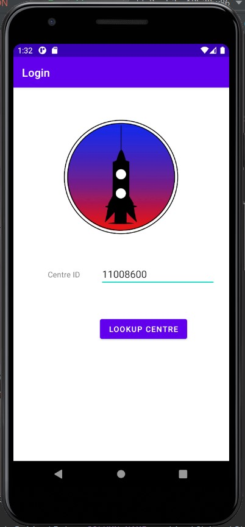
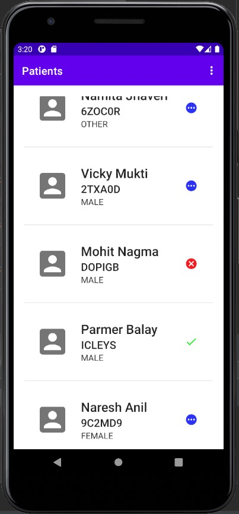
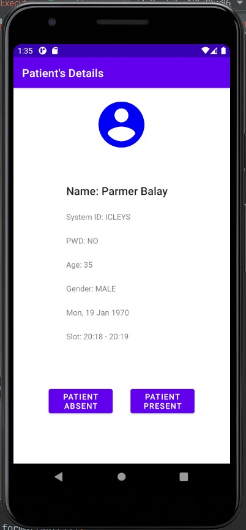
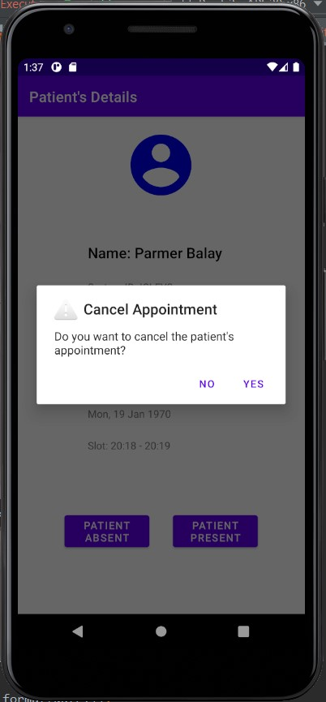
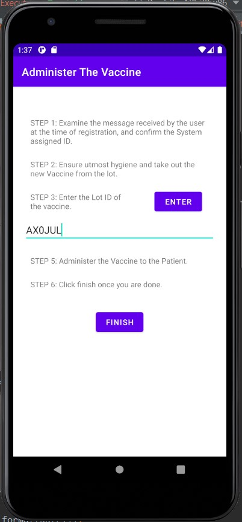

# RocketVaccineApp

An app for Rocket Vaccine distribution project. Syncs with the RocketVaccine server, a solution for the front-end workers.
 
 

The app fetches data from server about the scheduled vaccinations. The front-end workers can enter the center credentials

===

The list of patients scheduled for the day is visible on the screen along with their current status of vaccination.

=== 
They can see the full details of a patient and cancel the appointment if the patient doesn't appear for the day.

===
If the patient has been vaccinated, they can enter the lot number and enter the person who has been vaccinated.

 
 
===
 
Clone the repo and run with android studio. 
